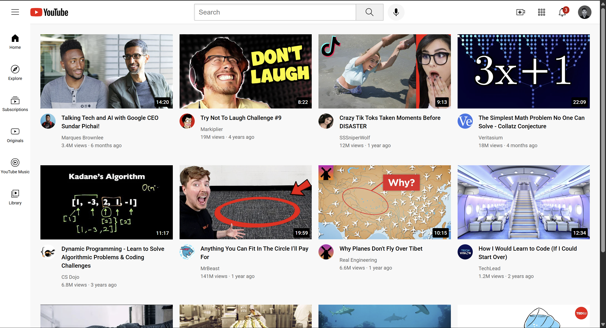

# 🎥 YouTube Homepage Clone (HTML & CSS)

This is a static clone of the **older YouTube homepage layout**, built using pure **HTML** and **CSS**.

I created this project to **sharpen my frontend development skills**, focusing on clean layout structuring and pixel-perfect UI recreation. While I already have a good understanding of HTML and CSS, this exercise helped me refine and reinforce key concepts.

> 🔗 **Live Demo:** [Click here to view the project](https://sreehari-07.github.io/youtube-clone/)

> 💡 **Project inspired by:** [SuperSimpleDev YouTube tutorial](https://www.youtube.com/@SuperSimpleDev)

---

## 📷 Screenshot

---

## 🛠️ Technologies Used

- **HTML5**
- **CSS3**

No JavaScript, frameworks, or libraries were used — just clean, semantic code.

---

## 📁 Project Highlights

- Recreated the older YouTube layout with side navigation, video grid, and top bar.
- Styled UI components such as buttons, icons, and thumbnails.
- Demonstrated strong layout and visual structuring using only HTML and CSS.

---

## 📚 Purpose

This project is purely for **educational purposes**, focused on practicing and improving frontend skills by recreating real-world UI.

---

## 🙋‍♂️ Author

**[Sreehari Sivan](https://github.com/Sreehari-07)**  
Fullstack Developer | Lifelong Learner | Passionate Coder

---

## 📄 License

This project is for **educational and personal use only**.

---
